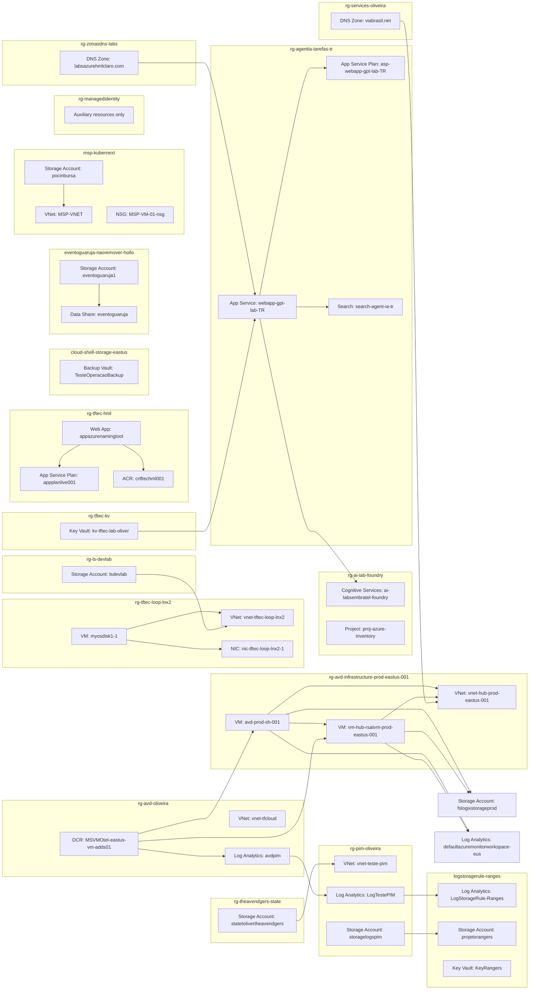

# Documento de Arquitetura do Ambiente Azure  
**Baseado no inventário fornecido**  
**Idioma:** Português  
**Papel:** Arquitetura Azure / Revisão técnica de ambiente

---

## 1. Sumário executivo

O ambiente apresenta uma **forte concentração em workloads de infraestrutura e identidade**, com destaque para:

- **Azure Virtual Desktop (AVD)** em produção
- **Serviços de identidade híbrida** com Azure AD Domain Services
- **Monitoramento e observabilidade** com Log Analytics, DCR/DCE, alertas e action groups
- **Workloads de IA / Azure AI Foundry / Cognitive Services**
- **Ambientes de suporte e automação** com VMs, redes, storage, Key Vault, Event Hub, Search, App Service e ACR

Há sinais claros de uma arquitetura **hub-and-spoke** para o ambiente AVD, além de múltiplos ambientes paralelos por projeto/cliente, com separação por Resource Groups. Também existem indícios de **ambientes de laboratório, homologação e produção coexistindo**, porém com **padronização inconsistente** em naming, governança, segurança e observabilidade.

---

## 2. Escopo e limitações da análise

Esta documentação foi produzida **somente com base no inventário de recursos**.  
Não foram fornecidos:

- configurações detalhadas dos recursos
- políticas Azure Policy
- RBAC
- topologia de rede completa
- peering, rotas, firewall, NAT, VPN/ER
- diagnósticos, métricas, logs ou tags
- dependências entre recursos

Portanto, as conclusões sobre arquitetura e riscos são **inferências técnicas** a partir dos nomes, tipos, grupos de recursos e padrões observáveis.

---

## 3. Visão geral do ambiente

### 3.1 Principais domínios funcionais identificados

1. **Infraestrutura AVD produção**
   - Host pool
   - Application Group
   - Workspace
   - Session hosts em VMs
   - Discos, NICs, NSGs, PIPs, VNet hub/spoke
   - FSLogix storage
   - Azure AD Domain Services

2. **Identidade e acesso**
   - Azure AD Domain Services
   - Managed Identity
   - Key Vault
   - VMs com extensões de domínio e MDE

3. **Observabilidade e governança**
   - Log Analytics Workspaces
   - DCR/DCE
   - Scheduled Query Rules
   - Activity Log Alerts
   - Smart Detector Alert Rules
   - Action Groups
   - Query Packs
   - Azure Monitor Account

4. **Plataforma de aplicações e automação**
   - App Service Plan / Web Apps
   - Container Registry
   - Storage Accounts
   - Search Service
   - Event Hub
   - Data Share
   - Backup Vault / Recovery Services Vault
   - Maintenance Configuration

5. **IA / Azure AI**
   - Cognitive Services Accounts
   - Projects do Azure AI Foundry

6. **Ambientes auxiliares e legados**
   - VMs avulsas
   - redes e NSGs por projeto
   - recursos de laboratório e testes
   - recursos com nomes não padronizados

---

## 4. Inventário organizado por tipo de recurso

---

### 4.1 Identidade e diretório

#### Azure AD Domain Services
- `theavendgers.local`  
  - RG: `rg-avd-infrastructure-prod-eastus-001`
  - Região: `eastus`

#### Managed Identity
- `uadevops`
  - RG: `rg-managedidentity`
  - Região: `brazilsouth`

#### Observações
- A presença de **AAD DS** indica dependência de autenticação baseada em domínio para workloads legados ou AVD.
- Não há evidência de Azure AD DS em múltiplas regiões ou estratégia de DR.

---

### 4.2 Azure Virtual Desktop

#### Host Pools
- `hp-avd-prod-001`

#### Application Groups
- `avd-prod-dag`

#### Workspaces
- `avd-prod-wks`

#### Session Hosts / VMs associadas
- `avd-prod-sh-001`
- `avd-prod-sh-002`

#### Discos associados
- `avd-prod-sh-001_OsDisk_...`
- `avd-prod-sh-002_disk1_...`

#### Recursos de rede associados
- NICs:
  - `avd-prod-nic-001`
  - `avd-prod-nic-002`
- NSGs:
  - `nsg-spoke-avd-avdsessionhosts-prod-eastus-001`
  - `nsg-hub-sharedsvcs-prod-eastus-001`
- Load Balancer:
  - `aadds-c57cb2cedecd478c8c32d29d7174d51a-lb`
- Public IP:
  - `aadds-c57cb2cedecd478c8c32d29d7174d51a-pip`
- VNet:
  - `vnet-hub-prod-eastus-001`
  - `vnet-spoke-avd-prod-eastus-001`

#### Storage para FSLogix
- `fslogixstorageprod`

#### Extensões de VM
- `JsonADDomainExtension`
- `MDE.Windows`
- `register-session-host-dsc-1`
- `register-session-host-dsc-2`

#### Leitura arquitetural
O AVD está claramente estruturado em **modelo hub-and-spoke**, com:
- hub para serviços compartilhados
- spoke para session hosts
- integração com domínio
- storage dedicado para perfis FSLogix
- hardening e onboarding via extensões

---

### 4.3 Compute

#### Virtual Machines
- `avd-prod-sh-001`
- `avd-prod-sh-002`
- `vm-hub-rsatvm-prod-eastus-001`

#### Disks
- `avd-prod-sh-001_OsDisk_...`
- `avd-prod-sh-002_disk1_...`
- `vm-hub-rsatvm-prod-eastus-001_OsDisk_...`
- `myosdisk1-1`
- `myosdisk1-2`

#### Extensões de VM
- `MDE.Windows`
- `install-rsat`
- `JsonADDomainExtension`
- `register-session-host-dsc-1`
- `register-session-host-dsc-2`

#### Observações
- Há VMs em produção e VMs de suporte/administrativas.
- Os nomes indicam uso de **RSAT**, **domain join**, **Microsoft Defender for Endpoint** e **DSC**.
- Existem discos com nomes genéricos (`myosdisk1-*`), o que sugere possível falta de padronização ou recursos de laboratório.

---

### 4.4 Rede

#### Virtual Networks
- `vnet-hub-prod-eastus-001`
- `vnet-spoke-avd-prod-eastus-001`
- `vnet-tfcloud`
- `vnet-az800`
- `MSP-VNET`
- `projeto-rangers-vnet`
- `vnet-tftec-loop-lnx2`
- `vnet-teste-pim`

#### Network Security Groups
- `nsg-spoke-avd-avdsessionhosts-prod-eastus-001`
- `nsg-hub-sharedsvcs-prod-eastus-001`
- `nsg-hub-entraidds-prod-brazilsouth-001`
- `vm-admcenter-nsg`
- `vm-adds02-nsg`
- `vm-linux-nsg`
- `vm-rodc01-nsg`
- `vm-proxy-psp-nsg`
- `vm-tfcloud-adds01-nsg`
- `vm-cl-sp-01-nsg`
- `vm-usa-adds01-nsg`
- `vm-adds01-nsg`
- `vm-cl-rj-01-nsg`
- `vm-cl-rs-01-nsg`
- `vm-jea-nsg`
- `MSP-VM-01-nsg`
- `MSP-VM-02-Win11-nsg`
- `projeto-rangers-nsg`
- `nsg-tftec-loop-lnx2`

#### Network Interfaces
Diversas NICs associadas a VMs e workloads:
- `avd-prod-nic-001`
- `avd-prod-nic-002`
- `nic-vm-hub-rsatvm-prod-eastus-001`
- `aadds-7fbf1497d36d4711bfd786ec65a586db-nic`
- `aadds-bc375271335045deafc887cfa0d381b5-nic`
- `vm-jea762`
- `vm-proxy-psp281`
- `vm-tfcloud-adds01753`
- `vm-linux437`
- `vm-admcenter466`
- `vm-usa-adds01736`
- `vm-cl-rj-01630`
- `vm-cl-rs-01386`
- `vm-cl-sp-01107`
- `nic-tftec-loop-lnx2-1`
- `nic-tftec-loop-lnx2-2`

#### Public IP Addresses
- `pip-vm-hub-rsatvm-prod-eastus-001`
- `vm-cl-sp-01-ip`
- `vm-proxy-psp-ip`
- `vm-jea-ip`
- `vm-usa-adds01-ip`
- `vm-linux-ip`
- `vm-admcenter-ip`
- `vm-cl-rs-01-ip`
- `vm-cl-rj-01-ip`
- `vm-tfcloud-adds01-ip`
- `projeto-rangers-ip`
- `pip-tftec-loop-lnx2-1`
- `pip-tftec-loop-lnx2-2`
- `aadds-c57cb2cedecd478c8c32d29d7174d51a-pip`

#### Load Balancer
- `aadds-c57cb2cedecd478c8c32d29d7174d51a-lb`

#### Network Watcher
- `NetworkWatcher_brazilsouth`

#### Leitura arquitetural
A rede mostra:
- segmentação por projeto/ambiente
- uso de NSGs por VM e por camada
- presença de IP público em várias VMs, o que aumenta a superfície de ataque
- coexistência de regiões `eastus` e `brazilsouth`

---

### 4.5 Monitoramento e observabilidade

#### Log Analytics Workspaces
- `avdpim`
- `testeoliver`
- `log2026`
- `LogTestePIM`
- `1945a8e0-89b3-4c3f-9ec9-d271178af69a-RG-AVD-Oliveira-EUS`
- `LogStorageRule-Ranges`

#### Azure Monitor Account
- `defaultazuremonitorworkspace-eus`

#### Data Collection Endpoints
- `defaultazuremonitorworkspace-eus`

#### Data Collection Rules
- `defaultazuremonitorworkspace-eus`
- `MSVMOtel-eastus-vm-adds01`
- `MSVMI-eastus-vm-adds01`

#### Scheduled Query Rules
- `Operational issues - LogTestePIM`
- `Data ingestion has hit the daily cap - LogTestePIM`
- `Usuário Removido do Grupo - W`
- `Remoção de usuário de grupo`
- `Criação - Alteração de Grupo`
- `Data ingestion is exceeding the ingestion rate limit - LogTestePIM`
- `Grupo Adicionado ou Removido`
- `Um novo grupo foi adicionado ou removido`

#### Activity Log Alerts
- `Usuário Adicionado ao Grupo2`
- `Problema de integridade do serviço em '1110025-laboper'`

#### Smart Detector Alert Rules
- `Failure Anomalies - AppServiceFantomasPRD`
- `Failure Anomalies - testeoliveira10`

#### Action Groups
- `rangers`
- `TestePim`
- `Application Insights Smart Detection`
- `azureapp-auto`

#### Query Pack
- `DefaultQueryPack`

#### Leitura arquitetural
Há uma estrutura de monitoramento relativamente madura, com:
- alertas de plataforma
- alertas de logs
- alertas de segurança/identidade
- DCR/DCE para Azure Monitor Agent
- action groups para notificação

Porém, há indícios de **fragmentação operacional**, com múltiplos workspaces e regras espalhadas por vários RGs.

---

### 4.6 Segurança, segredos e proteção

#### Key Vaults
- `kv-tftec-lab-oliver`
- `KeyRangers`

#### Backup / Recovery
- `TesteOperacaoBackup` - Backup Vault
- `vault122` - Recovery Services Vault

#### Microsoft Defender for Endpoint
- extensão `MDE.Windows` em VMs

#### Observações
- Há uso de Key Vault e proteção de endpoints, o que é positivo.
- Não há evidência de:
  - Private Endpoints
  - purge protection
  - soft delete
  - RBAC para Key Vault
  - integração com Managed Identity
  - política de rotação de segredos

---

### 4.7 Dados, integração e mensageria

#### Event Hub
- `hubpim`

#### Data Share
- `eventoguaruja`

#### Search Service
- `search-agent-ia-tr`

#### Storage Accounts
- `vmscripts9tlflgib`
- `projetorangers`
- `storagerangers2`
- `federationlw`
- `storagelogspim`
- `eventoguaruja1`
- `lsdevlab`
- `fslogixstorageprod`
- `statetolivertheavendgers`
- `stonamingtoolazure01`
- `pocinbursa`

#### Leitura arquitetural
O ambiente usa storage para múltiplos propósitos:
- perfis AVD
- scripts
- logs
- estado
- aplicações
- laboratórios

Isso é funcional, mas sugere necessidade de **governança mais rígida por finalidade**.

---

### 4.8 IA e serviços cognitivos

#### Cognitive Services Accounts
- `ai-labsembratel-foundry`
- `agent-ia-azure-tarefas`

#### Projects
- `agent-ia-azure-tarefas/agent-ia-azure-tarefas`
- `ai-labsembratel-foundry/proj-azure-inventory`

#### Leitura arquitetural
Há adoção de **Azure AI Foundry / projetos de IA**, indicando maturidade em experimentação e desenvolvimento de soluções de IA.

---

### 4.9 Plataforma de aplicações

#### App Service Plans
- `appplanlive001`
- `asp-webapp-gpt-lab-TR`

#### Web Apps
- `appazurenamingtool`
- `webapp-gpt-lab-TR`

#### Container Registry
- `crtftechml001`

#### Visual Studio / DevOps
- `testedevopsoperacao`
- `Projetos-Automate`

#### Observações
- Há workloads de aplicação em produção e laboratório.
- Não foi identificado uso de slots, Front Door, App Gateway ou Private Link no inventário.

---

### 4.10 DNS e resolução

#### DNS Zones
- `viabrasil.net`
- `labsazurehmlclaro.com`

#### Observações
- DNS está centralizado em zonas públicas.
- Não há evidência de Private DNS Zones no inventário.

---

### 4.11 Governança, manutenção e plataforma

#### Maintenance Configuration
- `MSP-Update-VMs-WInSRV`

#### Network Watcher
- `NetworkWatcher_brazilsouth`

#### Observações
- Há algum nível de automação de manutenção.
- Não há evidência de Azure Policy, Blueprints, Management Groups ou Defender for Cloud no inventário.

---

## 5. Padrões de arquitetura identificados

---

### 5.1 Hub-and-spoke

Evidência:
- `vnet-hub-prod-eastus-001`
- `vnet-spoke-avd-prod-eastus-001`
- NSGs com nomes de hub e spoke
- AVD em spoke com serviços compartilhados no hub

**Interpretação:**  
Arquitetura clássica para segmentação, controle de tráfego e centralização de serviços compartilhados.

**Ponto forte:** boa base para governança e isolamento.  
**Risco:** sem peering/UDR/firewall visíveis, não é possível confirmar enforcement real.

---

### 5.2 Separação por Resource Group e por domínio funcional

Exemplos:
- `rg-avd-infrastructure-prod-eastus-001`
- `rg-avd-oliveira`
- `rg-pim-oliveira`
- `rg-tftec-hml`
- `rg-tftec-loop-lnx2`
- `msp-kubernext`
- `logstoragerule-ranges`

**Interpretação:**  
Há tentativa de separar por ambiente/projeto/cliente.

**Risco:** a separação por RG não garante isolamento de segurança nem de custos se não houver tagging, RBAC e policy.

---

### 5.3 Padrão de automação por extensão de VM

Extensões observadas:
- Domain join
- MDE onboarding
- DSC registration
- instalação de ferramentas administrativas

**Interpretação:**  
Uso de extensões para bootstrap e configuração pós-provisionamento.

**Boa prática:** automatização e repetibilidade.  
**Risco:** dependência de extensões em VMs já em produção pode gerar drift e falhas de reexecução.

---

### 5.4 Observabilidade centralizada, porém fragmentada

Há múltiplos workspaces e alertas distribuídos.

**Interpretação:**  
O ambiente evoluiu por ondas/projetos, sem consolidação total.

**Risco:** dificuldade de correlação, duplicidade de custos e complexidade operacional.

---

### 5.5 Coexistência de produção, homologação e laboratório

Exemplos de nomes:
- `prod`
- `hml`
- `lab`
- `teste`
- `devlab`
- `pim`

**Interpretação:**  
Ambientes distintos coexistem no mesmo tenant/subscrição.

**Risco:** mistura de criticidade, exposição indevida e governança inconsistente.

---

## 6. Riscos identificados

---

### 6.1 Exposição excessiva por IP público
Há vários recursos com Public IP, inclusive VMs administrativas e de suporte.

**Risco:** aumento da superfície de ataque, brute force, exploração de serviços expostos.

**Recomendação:**  
- remover IP público quando possível
- usar Bastion, VPN, JIT, AVD, jumpbox controlado
- restringir NSGs por origem
- aplicar Azure Firewall / NVA se aplicável

---

### 6.2 Fragmentação de monitoramento
Múltiplos workspaces e regras em RGs distintos.

**Risco:** baixa visibilidade central, alertas duplicados, custo elevado.

**Recomendação:**  
- consolidar workspaces por domínio/ambiente
- padronizar DCR/DCE
- centralizar action groups e query packs

---

### 6.3 Padronização inconsistente de nomes
Exemplos:
- nomes genéricos como `myosdisk1-1`
- nomes com GUIDs
- mistura de idiomas e convenções
- recursos com nomes longos e pouco semânticos

**Risco:** operação difícil, automação frágil, troubleshooting lento.

**Recomendação:**  
definir naming convention formal com:
- ambiente
- região
- workload
- função
- sequência
- criticidade

---

### 6.4 Possível ausência de governança por tags
Não há tags no inventário.

**Risco:** dificuldade de chargeback/showback, ownership e lifecycle management.

**Recomendação:**  
tags mínimas:
- `Environment`
- `Owner`
- `CostCenter`
- `Application`
- `DataClassification`
- `Criticality`
- `Region`
- `Lifecycle`

---

### 6.5 Mistura de workloads de produção e teste
Há recursos `prod`, `hml`, `lab`, `teste` em várias subscrições/RGs.

**Risco:** contaminação operacional e de segurança.

**Recomendação:**  
separar por:
- subscriptions
- management groups
- policies
- RBAC
- redes segregadas

---

### 6.6 Segurança de Key Vault não evidenciada
Não há evidência de private endpoint, RBAC ou hardening.

**Risco:** exposição de segredos e dependência de acesso público.

**Recomendação:**  
- habilitar soft delete e purge protection
- usar RBAC
- restringir rede
- integrar com Managed Identity
- revisar logs de acesso

---

### 6.7 Falta de evidência de alta disponibilidade e DR
Não há evidência de:
- zonas de disponibilidade
- replicação entre regiões
- backup policy detalhada
- runbooks de recuperação

**Risco:** indisponibilidade prolongada em falha regional.

**Recomendação:**  
- definir RTO/RPO
- revisar backup e restore
- avaliar multi-region para workloads críticos
- documentar dependências

---

### 6.8 Possível uso de recursos legados ou não governados
Exemplos:
- discos genéricos
- RGs de cloud shell
- recursos com nomes não padronizados
- recursos em RGs aparentemente administrativos

**Risco:** shadow IT e recursos órfãos.

**Recomendação:**  
inventário contínuo, owner obrigatório e revisão de recursos órfãos.

---

## 7. Boas práticas não seguidas ou não evidenciadas

1. **Naming convention padronizada**
2. **Tagging corporativo**
3. **Separação forte por ambiente**
4. **Consolidação de observabilidade**
5. **Uso consistente de Private Link / Private DNS**
6. **Redução de IP público**
7. **Governança por Azure Policy**
8. **RBAC mínimo necessário**
9. **Segregação de subscrições por criticidade**
10. **Documentação de dependências e DR**
11. **Padronização de NSGs e regras**
12. **Centralização de logs e alertas**
13. **Hardening de Key Vault**
14. **Uso de Managed Identity em vez de credenciais estáticas**
15. **Ciclo de vida de recursos e limpeza de órfãos**

---

## 8. Recomendações por domínio

---

### 8.1 Identidade
- Validar se o uso de Azure AD DS é realmente necessário.
- Avaliar migração gradual para Entra ID + modern auth onde possível.
- Revisar contas de serviço e identidades gerenciadas.
- Padronizar acesso administrativo com PIM.

---

### 8.2 AVD
- Confirmar se o host pool está em modo pooled ou personal.
- Validar autoscaling.
- Revisar FSLogix storage com performance e redundância adequadas.
- Garantir que session hosts não tenham IP público.
- Usar imagens golden e pipeline de atualização.
- Revisar extensões e automação de onboarding.

---

### 8.3 Rede
- Implementar ou validar hub com firewall central.
- Reduzir exposição pública.
- Revisar NSGs para permitir apenas portas estritamente necessárias.
- Avaliar Private Endpoints para Storage, Key Vault, ACR, Search e Monitor.
- Documentar peering, UDR e DNS.

---

### 8.4 Monitoramento
- Consolidar workspaces por ambiente/domínio.
- Padronizar alertas e action groups.
- Revisar retenção e custos.
- Adotar nomenclatura consistente para regras e consultas.
- Centralizar logs críticos de segurança e identidade.

---

### 8.5 Segurança
- Habilitar Defender for Cloud e revisar recomendações.
- Aplicar Azure Policy para impedir IP público indevido.
- Proteger Key Vault com RBAC e rede privada.
- Usar JIT/Bastion para administração.
- Revisar MDE em todas as VMs críticas.

---

### 8.6 Governança
- Implementar management groups por ambiente.
- Criar baseline de policies.
- Exigir tags obrigatórias.
- Definir owners e lifecycle.
- Criar processo de revisão mensal de recursos órfãos.

---

### 8.7 Aplicações e dados
- Separar storage por finalidade.
- Revisar criptografia, acesso e rede.
- Validar backup e restore de workloads críticos.
- Para App Service, avaliar slots, managed identity e integração com Key Vault.
- Para ACR, restringir acesso e habilitar content trust se aplicável.

---

## 9. Estrutura sugerida de arquitetura-alvo

### 9.1 Camadas

#### Landing Zone
- Management Groups
- Subscriptions separadas por:
  - produção
  - homologação
  - desenvolvimento/laboratório
  - plataforma/shared services

#### Rede
- Hub central
- Spokes por workload
- Azure Firewall ou NVA
- Bastion
- Private DNS Zones
- Private Endpoints

#### Identidade
- Entra ID
- PIM
- Managed Identities
- AAD DS apenas onde necessário

#### Observabilidade
- Workspaces centralizados por domínio
- DCR/DCE padronizados
- Action Groups corporativos
- Alertas por criticidade

#### Segurança
- Key Vault privado
- Defender for Cloud
- Azure Policy
- JIT
- MDE

#### Workloads
- AVD em spoke dedicado
- Apps em App Service/Container/VM conforme necessidade
- IA em subscriptions controladas
- Storage segregado por uso

---

## 10. Matriz resumida de recursos por categoria

### Infraestrutura principal
- AVD: sim
- Identidade híbrida: sim
- Monitoramento: sim
- Segurança: parcial
- Automação: parcial
- IA: sim
- Aplicações web: sim
- Containers: sim
- Mensageria: sim
- Backup: sim

### Maturidade observada
- **Alta:** AVD, monitoramento básico, segmentação por RG
- **Média:** segurança, automação, IA
- **Baixa a média:** governança, padronização, consolidação de observabilidade, DR

---

## 11. Conclusão

O ambiente Azure analisado possui uma base arquitetural relevante e já demonstra uso de padrões corporativos como **hub-and-spoke**, **AVD**, **monitoramento com Azure Monitor**, **uso de Key Vault**, **Managed Identity** e **serviços de IA**.  

Entretanto, o inventário também evidencia **crescimento orgânico**, com múltiplos ambientes, nomenclaturas inconsistentes, recursos possivelmente órfãos e exposição pública acima do ideal. A principal oportunidade está em **governança, padronização, segurança de rede e consolidação operacional**.

---

## 12. Próximos passos recomendados

1. **Inventariar dependências reais** entre recursos
2. **Mapear subscriptions, management groups e RBAC**
3. **Extrair tags e políticas existentes**
4. **Validar exposição pública e NSGs**
5. **Consolidar observabilidade**
6. **Revisar Key Vault, Storage e AVD para private access**
7. **Documentar DR, backup e RTO/RPO**
8. **Criar baseline de arquitetura e naming convention**
9. **Classificar recursos por criticidade e owner**
10. **Executar revisão de segurança com Azure Policy e Defender for Cloud**

---

Se você quiser, eu posso transformar este conteúdo em um dos formatos abaixo:

1. **Documento formal em estilo Word/Confluence**
2. **Relatório executivo + anexo técnico**
3. **Tabela detalhada por recurso com classificação, risco e recomendação**
4. **Diagrama textual da arquitetura atual e da arquitetura alvo**
5. **Plano de ação priorizado em 30/60/90 dias**

---

## Diagrama de Arquitetura

