# Documento de Arquitetura do Ambiente Azure  
**Baseado no inventário fornecido**  
**Idioma:** Português  
**Papel:** Arquitetura Azure / Revisão técnica

---

## 1. Sumário executivo

O ambiente inventariado apresenta uma **forte concentração em workloads de infraestrutura de virtualização e serviços de identidade**, com destaque para:

- **Azure Virtual Desktop (AVD)** em produção.
- **Active Directory Domain Services gerenciado (AAD DS)**.
- **Máquinas virtuais Windows/Linux** com extensões de domínio, MDE e automação.
- **Rede hub-and-spoke** com VNETs, NSGs, NICs, IPs públicos e Load Balancer.
- **Observabilidade** com Log Analytics, DCR/DCE, alertas, action groups e smart detector rules.
- **Serviços de IA** com Azure AI/Cognitive Services e projetos associados.
- **Serviços auxiliares** como Key Vault, Storage Accounts, ACR, Event Hub, Search, Backup Vault e Recovery Services Vault.

Há sinais claros de **ambientes mistos de produção, homologação, laboratório e automação**, com recursos distribuídos entre vários resource groups e assinaturas/escopos implícitos. O inventário também evidencia **uso recorrente de recursos gerenciados por ferramentas de IaC**, possivelmente Terraform, dada a nomenclatura de alguns recursos e a presença de storage de state.

---

## 2. Escopo e premissas

### 2.1 Escopo
Este documento cobre:
- Organização do inventário por tipo de recurso.
- Identificação de padrões arquiteturais.
- Análise de riscos.
- Boas práticas não observadas ou parcialmente observadas.
- Recomendações técnicas.

### 2.2 Limitações
O inventário contém apenas:
- Nome
- Tipo
- Região
- Resource Group

Não há informações sobre:
- SKU/tier
- Configurações de segurança
- Dependências entre recursos
- Tags
- Políticas
- RBAC
- Diagnósticos
- Zonas de disponibilidade
- Private Endpoints
- Topologia de peering
- Regras de NSG/Firewall
- Configuração de backup/DR

Portanto, a análise é **arquitetural e inferencial**, baseada em nomenclatura, tipos e agrupamentos.

---

# 3. Visão geral do ambiente

## 3.1 Principais domínios funcionais identificados
1. **Infraestrutura AVD produção**
2. **Identidade e domínio**
3. **Rede e conectividade**
4. **Observabilidade e monitoramento**
5. **IA / Cognitive Services**
6. **Aplicações Web**
7. **Dados e armazenamento**
8. **Segurança e governança**
9. **Automação e DevOps**
10. **Backup e recuperação**

---

# 4. Inventário organizado por tipo de recurso

---

## 4.1 Identidade e diretório

### Azure AD Domain Services
- `theavendgers.local`  
  - Tipo: `microsoft.aad/domainservices`
  - Região: `eastus`
  - RG: `rg-avd-infrastructure-prod-eastus-001`

### Managed Identity
- `uadevops`
  - Tipo: `microsoft.managedidentity/userassignedidentities`
  - Região: `brazilsouth`
  - RG: `rg-managedidentity`

### Leitura arquitetural
O uso de **AAD DS** indica dependência de autenticação baseada em domínio para workloads legados ou VMs/AVD que necessitam de LDAP/Kerberos/Group Policy. A presença de identidade gerenciada sugere integração com automação e acesso seguro a recursos Azure.

### Riscos
- Dependência crítica de AAD DS para autenticação de VMs e AVD.
- Falta de evidência de redundância/HA do serviço gerenciado.
- Possível acoplamento excessivo entre domínio e workloads de produção.

---

## 4.2 Compute

### Virtual Machines
- `avd-prod-sh-001`
- `vm-hub-rsatvm-prod-eastus-001`
- `avd-prod-sh-002`

### Managed Disks
- `vm-hub-rsatvm-prod-eastus-001_OsDisk_...`
- `myosdisk1-1`
- `avd-prod-sh-001_OsDisk_...`
- `avd-prod-sh-002_disk1_...`
- `myosdisk1-2`

### VM Extensions
- `MDE.Windows`
- `register-session-host-dsc-1`
- `register-session-host-dsc-2`
- `install-rsat`
- `JsonADDomainExtension`

### Leitura arquitetural
Os nomes indicam:
- **Session hosts AVD** (`avd-prod-sh-001`, `avd-prod-sh-002`)
- **VM de suporte/administrativa** (`vm-hub-rsatvm-prod-eastus-001`)
- Extensões para:
  - **Microsoft Defender for Endpoint**
  - **Domain join**
  - **DSC / registro de session host**
  - **Instalação de RSAT**

### Padrões observados
- Uso de extensões para automação de configuração.
- Session hosts em produção.
- Possível padronização por imagem e bootstrap.

### Riscos
- Extensões podem falhar em sequência e gerar drift operacional.
- Uso de discos com nomes genéricos (`myosdisk1-1`, `myosdisk1-2`) sugere baixa padronização.
- Não há evidência de Availability Set/Zone.
- Não há evidência de Azure Update Manager ou estratégia de patching formal.

---

## 4.3 Azure Virtual Desktop

### Host Pools
- `hp-avd-prod-001`

### Application Groups
- `avd-prod-dag`

### Workspaces
- `avd-prod-wks`

### Leitura arquitetural
Há uma implementação clássica de AVD:
- Host pool de produção
- Application group associado
- Workspace para publicação

### Padrões observados
- Estrutura AVD coerente e separada por função.
- Resource group dedicado à infraestrutura AVD.

### Riscos
- Não há evidência de:
  - scaling plan
  - autoscale
  - zone redundancy
  - FSLogix com Private Endpoint
  - monitoramento específico de AVD
- Session hosts parecem poucos para produção, o que pode indicar risco de capacidade.

---

## 4.4 Rede

### Virtual Networks
- `vnet-hub-prod-eastus-001`
- `vnet-spoke-avd-prod-eastus-001`
- `vnet-tftec-loop-lnx2`
- `vnet-tfcloud`
- `vnet-az800`
- `MSP-VNET`
- `vnet-teste-pim`
- `projeto-rangers-vnet`

### Network Security Groups
Diversos NSGs, incluindo:
- `nsg-hub-sharedsvcs-prod-eastus-001`
- `nsg-hub-entraidds-prod-brazilsouth-001`
- `nsg-spoke-avd-avdsessionhosts-prod-eastus-001`
- NSGs por VM: `vm-adds01-nsg`, `vm-proxy-psp-nsg`, etc.

### Network Interfaces
Diversas NICs associadas a VMs e workloads.

### Public IP Addresses
Diversos IPs públicos para VMs e serviços.

### Load Balancer
- `aadds-c57cb2cedecd478c8c32d29d7174d51a-lb`

### Network Watcher
- `NetworkWatcher_brazilsouth`

### Leitura arquitetural
O ambiente mostra um padrão **hub-and-spoke**, com:
- Hub para serviços compartilhados
- Spokes para AVD e outros workloads
- NSGs por workload/VM
- Uso de IP público em várias VMs

### Riscos
- Exposição excessiva à internet via IP público em VMs.
- Possível ausência de Azure Firewall/NVA no hub.
- Não há evidência de:
  - UDRs
  - Azure Firewall
  - DDoS Protection Standard
  - Private Link
  - Bastion
- NSGs muito fragmentados podem aumentar complexidade operacional.
- Nome de NSG `nsg-hub-entraidds-prod-brazilsouth-001` em `eastus` sugere possível inconsistência de nomenclatura/região.

---

## 4.5 Monitoramento, observabilidade e alertas

### Log Analytics Workspaces
- `log2026`
- `testeoliver`
- `avdpim`
- `LogTestePIM`
- `LogStorageRule-Ranges`
- `1945a8e0-89b3-4c3f-9ec9-d271178af69a-RG-AVD-Oliveira-EUS`

### Query Pack
- `DefaultQueryPack`

### Data Collection Endpoints / Rules
- `defaultazuremonitorworkspace-eus` (DCE)
- `defaultazuremonitorworkspace-eus` (DCR)
- `MSVMI-eastus-vm-adds01`
- `MSVMOtel-eastus-vm-adds01`

### Action Groups
- `azureapp-auto`
- `Application Insights Smart Detection`
- `TestePim`
- `rangers`

### Activity Log Alerts
- `Problema de integridade do serviço em '1110025-laboper'`
- `Usuário Adicionado ao Grupo2`

### Scheduled Query Rules
- `Data ingestion has hit the daily cap - LogTestePIM`
- `Usuário Removido do Grupo - W`
- `Grupo Adicionado ou Removido`
- `Data ingestion is exceeding the ingestion rate limit - LogTestePIM`
- `Criação - Alteração de Grupo`
- `Remoção de usuário de grupo`
- `Um novo grupo foi adicionado ou removido`
- `Operational issues - LogTestePIM`

### Smart Detector Alert Rules
- `Failure Anomalies - AppServiceFantomasPRD`
- `Failure Anomalies - testeoliveira10`

### Leitura arquitetural
Há uma camada de observabilidade relativamente madura, com:
- Workspaces múltiplos
- DCR/DCE
- Alertas de atividade e query
- Action groups
- Smart detection

### Riscos
- Fragmentação de workspaces pode dificultar correlação.
- Alertas de ingestão atingindo limite diário indicam risco de perda de telemetria.
- Não há evidência de centralização em um workspace corporativo.
- Possível excesso de alertas pontuais e pouca governança de ruído.

---

## 4.6 Segurança

### Microsoft Defender for Endpoint
- Extensão `MDE.Windows` em VMs

### Key Vaults
- `KeyRangers`
- `kv-tftec-lab-oliver`

### Leitura arquitetural
Há evidência de uso de cofre de segredos e proteção de endpoints.

### Riscos
- Não há evidência de:
  - soft delete/purge protection
  - private endpoint
  - RBAC no Key Vault
  - rotação de segredos
  - centralização de segredos por ambiente
- Extensão MDE não garante postura completa de segurança.

---

## 4.7 Dados e armazenamento

### Storage Accounts
- `lsdevlab`
- `stonamingtoolazure01`
- `storagerangers2`
- `vmscripts9tlflgib`
- `fslogixstorageprod`
- `federationlw`
- `eventoguaruja1`
- `projetorangers`
- `statetolivertheavendgers`
- `pocinbursa`
- `storagelogspim`

### Backup Vault / Recovery Services Vault
- `TesteOperacaoBackup`
- `vault122`

### Leitura arquitetural
Os storage accounts suportam:
- FSLogix para AVD
- scripts e automação
- state de infraestrutura
- logs e dados de aplicações
- workloads de laboratório

### Riscos
- `fslogixstorageprod` é crítico para AVD; sem Private Endpoint e redundância adequada há risco de indisponibilidade.
- `statetolivertheavendgers` sugere state de Terraform em storage, mas não há evidência de locking/segurança reforçada.
- Nomes genéricos e mistura de ambientes indicam risco de governança fraca.
- Não há evidência de:
  - versioning
  - immutability
  - lifecycle management
  - encryption com CMK
  - acesso restrito por rede

---

## 4.8 Containers e registro

### Container Registry
- `crtftechml001`

### Leitura arquitetural
Há um ACR para suporte a workloads de container, possivelmente em ambiente HML.

### Riscos
- Não há evidência de:
  - private endpoint
  - content trust
  - retention policy
  - scanner de vulnerabilidade
  - geo-replication

---

## 4.9 IA e serviços cognitivos

### Cognitive Services / Azure AI
- `agent-ia-azure-tarefas`
- `ai-labsembratel-foundry`

### Projects
- `agent-ia-azure-tarefas/agent-ia-azure-tarefas`
- `ai-labsembratel-foundry/proj-azure-inventory`

### Search
- `search-agent-ia-tr`

### Leitura arquitetural
Há uma iniciativa clara de **Azure AI Foundry / Cognitive Services**, com projetos associados e Azure AI Search.

### Padrões observados
- Separação por resource group.
- Estrutura de projeto dentro da conta de Cognitive Services.
- Uso de Search para RAG/assistentes.

### Riscos
- Não há evidência de:
  - private networking
  - managed identities integradas
  - segregação por ambiente
  - governança de dados sensíveis
  - controle de custo por projeto
- Potencial exposição de endpoints públicos.

---

## 4.10 Web Apps e App Service Plans

### App Service Plans
- `appplanlive001`
- `asp-webapp-gpt-lab-TR`

### Web Apps
- `appazurenamingtool`
- `webapp-gpt-lab-TR`

### Leitura arquitetural
Há workloads web em produção/homologação, incluindo uma aplicação de laboratório de GPT.

### Riscos
- Não há evidência de deployment slots.
- Não há evidência de VNet Integration.
- Não há evidência de private endpoint.
- Smart detector rules existem para algumas apps, o que é positivo, mas não garante governança completa.

---

## 4.11 DevOps e automação

### Azure DevOps / Visual Studio Accounts
- `Projetos-Automate`
- `testedevopsoperacao`

### Maintenance Configuration
- `MSP-Update-VMs-WInSRV`

### Leitura arquitetural
O ambiente possui elementos de automação e manutenção, sugerindo operação contínua e possível uso de pipelines.

### Riscos
- Não há evidência de:
  - pipelines padronizados
  - approvals
  - segregação de ambientes
  - managed identity para automação
  - policy-as-code
- Maintenance configuration isolada pode não cobrir todo o parque de VMs.

---

## 4.12 DNS e resolução

### DNS Zones
- `viabrasil.net`
- `labsazurehmlclaro.com`

### Leitura arquitetural
Há zonas DNS públicas gerenciadas no Azure.

### Riscos
- Não há evidência de:
  - DNS privado
  - split-horizon
  - proteção contra alterações indevidas
  - automação de registros
- Zonas públicas exigem governança rigorosa.

---

## 4.13 Data Sharing

### Data Share Account
- `eventoguaruja`

### Leitura arquitetural
Indica compartilhamento de dados entre organizações ou domínios.

### Riscos
- Não há evidência de classificação de dados, contratos de compartilhamento ou controles de acesso refinados.

---

## 4.14 Eventing

### Event Hub Namespace
- `hubpim`

### Leitura arquitetural
Provável uso para ingestão/integração de eventos, possivelmente ligado a PIM ou automação.

### Riscos
- Não há evidência de:
  - capture
  - private endpoint
  - RBAC granular
  - throughput units adequadas
  - disaster recovery

---

# 5. Padrões de arquitetura identificados

## 5.1 Hub-and-spoke
Evidência forte em:
- `vnet-hub-prod-eastus-001`
- `vnet-spoke-avd-prod-eastus-001`
- NSGs de hub e spoke

### Interpretação
Arquitetura adequada para centralizar serviços compartilhados e isolar workloads.

### Observação
Parece haver implementação parcial, sem evidência de firewall central ou governança de tráfego.

---

## 5.2 AVD corporativo/produção
Evidência em:
- Host pool
- Workspace
- Application group
- Session hosts
- FSLogix storage

### Interpretação
Padrão típico de VDI/DAAS em produção.

---

## 5.3 Infraestrutura como código
Evidências indiretas:
- nomes de recursos com padrão repetitivo
- storage de state
- recursos de laboratório e produção com nomenclatura consistente em alguns grupos

### Interpretação
Provável uso de Terraform/ARM/Bicep.

### Risco
Padrão não totalmente uniforme, indicando possível coexistência de IaC com criação manual.

---

## 5.4 Observabilidade orientada a alertas
Evidências:
- action groups
- scheduled query rules
- activity log alerts
- smart detectors
- DCR/DCE

### Interpretação
Boa maturidade de monitoramento, mas com fragmentação.

---

## 5.5 Separação por domínio funcional
Resource groups sugerem separação por:
- infraestrutura AVD
- PIM
- laboratório
- identidade
- automação
- logs
- AI

### Interpretação
Boa prática de organização, embora com inconsistências de naming e possível mistura de ambientes.

---

# 6. Riscos principais do ambiente

## 6.1 Riscos críticos
1. **Exposição de VMs com IP público**
   - Aumenta superfície de ataque.
2. **Fragmentação de observabilidade**
   - Múltiplos workspaces dificultam correlação e resposta.
3. **Dependência de AAD DS**
   - Serviço crítico para autenticação e domínio.
4. **Possível ausência de controles de rede centralizados**
   - Sem evidência de Azure Firewall/Bastion/Private Link.
5. **Storage accounts críticos sem evidência de hardening**
   - FSLogix, state, logs e scripts podem estar expostos.
6. **Alertas de ingestão atingindo limite**
   - Risco de perda de telemetria.
7. **Mistura de ambientes**
   - Produção, HML, lab e automação coexistem com padrões heterogêneos.

---

## 6.2 Riscos médios
1. **Nomenclatura inconsistente**
   - Recursos com nomes genéricos ou pouco descritivos.
2. **NSGs por VM em excesso**
   - Complexidade operacional e risco de regras divergentes.
3. **Ausência de evidência de tagging**
   - Dificulta chargeback, ownership e governança.
4. **Possível falta de private endpoints**
   - Em Key Vault, Storage, ACR, AI, Search e Log Analytics.
5. **Possível ausência de backup/DR formal**
   - Embora existam vaults, não há evidência de cobertura completa.

---

# 7. Boas práticas não seguidas ou não evidentes

## 7.1 Governança
- Não há evidência de **tags obrigatórias**.
- Não há evidência de **Azure Policy**.
- Não há evidência de **Management Groups**.
- Não há evidência de **padronização de naming** em todo o ambiente.

## 7.2 Segurança
- IP público em VMs sem justificativa explícita.
- Falta de evidência de **Bastion**.
- Falta de evidência de **Azure Firewall**.
- Falta de evidência de **Private Link**.
- Falta de evidência de **Key Vault com purge protection/soft delete**.
- Falta de evidência de **RBAC em vez de access policies**.

## 7.3 Operação
- Workspaces de Log Analytics dispersos.
- Alertas possivelmente redundantes.
- Não há evidência de **runbooks** ou automação de remediação.
- Não há evidência de **patch management centralizado** para todas as VMs.

## 7.4 Plataforma
- Não há evidência de **Availability Zones**.
- Não há evidência de **autoscaling** para AVD/App Service.
- Não há evidência de **segregação clara por assinatura** entre produção e não produção.

---

# 8. Recomendações técnicas

## 8.1 Curto prazo
1. **Inventariar e classificar todos os recursos por ambiente**
   - Produção, HML, DEV, laboratório, compartilhado.
2. **Aplicar tags obrigatórias**
   - `Environment`, `Owner`, `CostCenter`, `Criticality`, `DataClassification`.
3. **Revisar VMs com IP público**
   - Remover onde possível.
   - Substituir por Bastion, VPN ou JIT.
4. **Centralizar observabilidade**
   - Reduzir número de workspaces.
   - Definir workspace corporativo por domínio/ambiente.
5. **Revisar alertas de ingestão**
   - Ajustar daily cap, retenção e filtros.
6. **Auditar Key Vaults e Storage Accounts**
   - Habilitar soft delete, purge protection, private endpoint e RBAC.
7. **Validar hardening do AVD**
   - FSLogix, autoscale, patching, MDE, políticas de sessão.

---

## 8.2 Médio prazo
1. **Implementar Azure Policy**
   - Bloquear IP público em VMs sem exceção.
   - Exigir tags.
   - Exigir private endpoints para PaaS críticos.
2. **Adotar hub de segurança**
   - Azure Firewall, Bastion, DDoS, UDRs.
3. **Padronizar IaC**
   - Terraform/Bicep com módulos reutilizáveis.
   - State protegido e segregado.
4. **Consolidar monitoramento**
   - Workspaces por domínio.
   - Query packs e alertas padronizados.
5. **Revisar arquitetura de AVD**
   - Autoscale, imagens douradas, update rings, FSLogix resiliente.
6. **Reforçar identidade**
   - Managed identities para automação.
   - PIM para acessos privilegiados.
7. **Revisar segurança de AI/Search**
   - Private networking, RBAC, segregação por projeto.

---

## 8.3 Longo prazo
1. **Separar assinaturas por ambiente**
   - Prod, non-prod, shared services, sandbox.
2. **Criar landing zone corporativa**
   - Management groups, policies, RBAC, logging central.
3. **Adotar Zero Trust**
   - Menor privilégio, segmentação, acesso condicional.
4. **Implementar DR formal**
   - RTO/RPO por workload.
   - Testes periódicos.
5. **Governança FinOps**
   - Chargeback/showback, budgets, alertas de custo.

---

# 9. Documentação técnica por domínio

---

## 9.1 Domínio AVD

### Componentes
- Host pool: `hp-avd-prod-001`
- App group: `avd-prod-dag`
- Workspace: `avd-prod-wks`
- Session hosts: `avd-prod-sh-001`, `avd-prod-sh-002`
- FSLogix storage: `fslogixstorageprod`

### Fluxo lógico
Usuários autenticam via domínio, acessam o workspace, recebem aplicações/publicações do app group e conectam-se aos session hosts.

### Pontos de atenção
- Capacidade dos hosts
- Perfil FSLogix
- Patching
- Escalabilidade
- Segurança de acesso

---

## 9.2 Domínio Identidade

### Componentes
- AAD DS: `theavendgers.local`
- Extensões de domínio nas VMs

### Fluxo lógico
VMs e hosts AVD ingressam no domínio gerenciado para autenticação e políticas.

### Pontos de atenção
- DNS
- Sincronização de identidades
- Dependência do serviço gerenciado

---

## 9.3 Domínio Rede

### Componentes
- Hub VNET
- Spokes
- NSGs
- NICs
- Public IPs
- Load Balancer

### Fluxo lógico
Tráfego entre workloads é segmentado por NSG e topologia hub-spoke.

### Pontos de atenção
- Roteamento
- Exposição pública
- Segmentação
- Inspeção de tráfego

---

## 9.4 Domínio Observabilidade

### Componentes
- Log Analytics
- DCR/DCE
- Action Groups
- Scheduled Query Rules
- Activity Log Alerts
- Smart Detectors

### Fluxo lógico
Logs e métricas são coletados, processados e geram alertas para times responsáveis.

### Pontos de atenção
- Centralização
- Ruído
- Retenção
- Custos de ingestão

---

## 9.5 Domínio IA

### Componentes
- Cognitive Services
- Projects
- Search Service

### Fluxo lógico
Projetos de IA consomem serviços cognitivos e busca para aplicações inteligentes.

### Pontos de atenção
- Segurança de dados
- Isolamento
- Custos
- Governança de prompts/dados

---

# 10. Conclusão

O ambiente apresenta uma base arquitetural relevante e funcional, com **forte presença de AVD, identidade gerenciada, rede segmentada, observabilidade e serviços de IA**. Entretanto, o inventário também revela **lacunas importantes de governança, segurança e padronização**, especialmente em:

- exposição pública,
- fragmentação de monitoramento,
- ausência de evidências de private networking,
- possível falta de políticas corporativas,
- inconsistência de naming e segregação de ambientes.

Em resumo, trata-se de um ambiente com **boa amplitude de serviços**, mas que precisa evoluir para um modelo mais maduro de **landing zone, Zero Trust, governança centralizada e operação padronizada**.

---

# 11. Próximos passos recomendados

Se desejar, posso transformar este conteúdo em um dos formatos abaixo:

1. **Documento formal em estilo Word/Confluence**
2. **Relatório executivo para diretoria**
3. **Arquitetura em formato de matriz por recurso**
4. **Diagrama lógico textual do ambiente**
5. **Plano de ação priorizado por criticidade**
6. **Checklist de conformidade Azure Well-Architected Framework**
7. **Versão com tabela detalhada por recurso individual**

Se quiser, no próximo passo eu posso gerar uma **tabela completa com todos os recursos do inventário, agrupados por tipo, RG e recomendações específicas por item**.

---

## Diagrama de Arquitetura

```mermaid
flowchart LR
  %% RG: rg-avd-infrastructure-prod-eastus-001
  subgraph RG1["rg-avd-infrastructure-prod-eastus-001"]
    direction TB
    rg1_vnet["VNet: vnet-hub-prod-eastus-001"]
    rg1_vm1["VM: avd-prod-sh-001"]
    rg1_vm2["VM: avd-prod-sh-002"]
  end

  %% RG: rg-avd-oliveira
  subgraph RG2["rg-avd-oliveira"]
    direction TB
    rg2_vnet["VNet: vnet-tfcloud"]
    rg2_ws["Log Analytics: avdpim"]
    rg2_dcr["DCR: MSVMI-eastus-vm-adds01"]
  end

  %% RG: rg-agentia-tarefas-tr
  subgraph RG3["rg-agentia-tarefas-tr"]
    direction TB
    rg3_app["App Service: webapp-gpt-lab-TR"]
    rg3_plan["App Service Plan: asp-webapp-gpt-lab-TR"]
    rg3_ai["Cognitive Services: agent-ia-azure-tarefas"]
  end

  %% RG: rg-ai-lab-foundry
  subgraph RG4["rg-ai-lab-foundry"]
    direction TB
    rg4_ai["Cognitive Services: ai-labsembratel-foundry"]
    rg4_proj["Project: proj-azure-inventory"]
  end

  %% RG: rg-tftec-loop-lnx2
  subgraph RG5["rg-tftec-loop-lnx2"]
    direction TB
    rg5_vnet["VNet: vnet-tftec-loop-lnx2"]
    rg5_vm["VM: myosdisk1-1"]
    rg5_nsg["NSG: nsg-tftec-loop-lnx2"]
  end

  %% RG: rg-tftec-hml
  subgraph RG6["rg-tftec-hml"]
    direction TB
    rg6_app["App Service: appazurenamingtool"]
    rg6_plan["App Service Plan: appplanlive001"]
    rg6_acr["Container Registry: crtftechml001"]
  end

  %% RG: cloud-shell-storage-eastus
  subgraph RG7["cloud-shell-storage-eastus"]
    direction TB
    rg7_vault["Recovery Vault: vault122"]
  end

  %% RG: eventoguaruja-naoremover-hollo
  subgraph RG8["eventoguaruja-naoremover-hollo"]
    direction TB
    rg8_sa["Storage Account: eventoguaruja1"]
    rg8_ds["Data Share: eventoguaruja"]
  end

  %% RG: rg-pim-oliveira
  subgraph RG9["rg-pim-oliveira"]
    direction TB
    rg9_vnet["VNet: vnet-teste-pim"]
    rg9_ws["Log Analytics: LogTestePIM"]
    rg9_sa["Storage Account: storagelogspim"]
  end

  %% RG: azureapp-auto-alerts-1508a8-andre_sion_labsembratel_onmicrosoft_com
  subgraph RG10["azureapp-auto-alerts-1508a8-andre_sion_labsembratel_onmicrosoft_com"]
    direction TB
    rg10_alert["Activity Log Alert: Problema de integridade do serviço em '1110025-laboper'"]
  end

  %% RG: logstoragerule-ranges
  subgraph RG11["logstoragerule-ranges"]
    direction TB
    rg11_ws["Log Analytics: LogStorageRule-Ranges"]
    rg11_sa["Storage Account: storagerangers2"]
    rg11_kv["Key Vault: KeyRangers"]
  end

  %% RG: ma_defaultazuremonitorworkspace-eus_eastus_managed
  subgraph RG12["ma_defaultazuremonitorworkspace-eus_eastus_managed"]
    direction TB
    rg12_dce["DCE: defaultazuremonitorworkspace-eus"]
    rg12_dcr["DCR: defaultazuremonitorworkspace-eus"]
  end

  %% RG: rg-services-oliveira
  subgraph RG13["rg-services-oliveira"]
    direction TB
    rg13_dns["DNS Zone: viabrasil.net"]
  end

  %% RG: rg-zonasdns-labs
  subgraph RG14["rg-zonasdns-labs"]
    direction TB
    rg14_dns["DNS Zone: labsazurehmlclaro.com"]
  end

  %% RG: loganalyticsdefaultresources
  subgraph RG15["loganalyticsdefaultresources"]
    direction TB
    rg15_qp["Query Pack: DefaultQueryPack"]
  end

  %% RG: testepim2026
  subgraph RG16["testepim2026"]
    direction TB
    rg16_ws["Log Analytics: log2026"]
  end

  %% RG: rg-ls-devlab
  subgraph RG17["rg-ls-devlab"]
    direction TB
    rg17_sa["Storage Account: lsdevlab"]
  end

  %% RG: rg-theavendgers-state
  subgraph RG18["rg-theavendgers-state"]
    direction TB
    rg18_sa["Storage Account: statetolivertheavendgers"]
  end

  %% RG: msp-kubernext
  subgraph RG19["msp-kubernext"]
    direction TB
    rg19_vnet["VNet: MSP-VNET"]
    rg19_sa["Storage Account: pocinbursa"]
    rg19_mc["Maintenance: MSP-Update-VMs-WInSRV"]
  end

  %% RG: rg-managedidentity
  subgraph RG20["rg-managedidentity"]
    direction TB
    rg20_note["(ignored: Managed Identity)"]
  end

  %% RG: rg-tftec-kv
  subgraph RG21["rg-tftec-kv"]
    direction TB
    rg21_kv["Key Vault: kv-tftec-lab-oliver"]
  end

  %% RG: rg-avd-oliveira relationships
  rg2_ws --> rg2_dcr

  %% Cross-RG logical relationships
  rg3_app --> rg3_plan
  rg6_app --> rg6_plan
  rg1_vm1 --> rg1_vnet
  rg1_vm2 --> rg1_vnet
  rg5_vm --> rg5_vnet
  rg9_ws --> rg9_sa
  rg11_ws --> rg11_sa
  rg12_dcr --> rg2_ws
  rg12_dce --> rg2_ws
  rg3_ai --> rg3_app
  rg4_ai --> rg4_proj
  rg8_ds --> rg8_sa
  rg19_mc --> rg19_vnet
```

